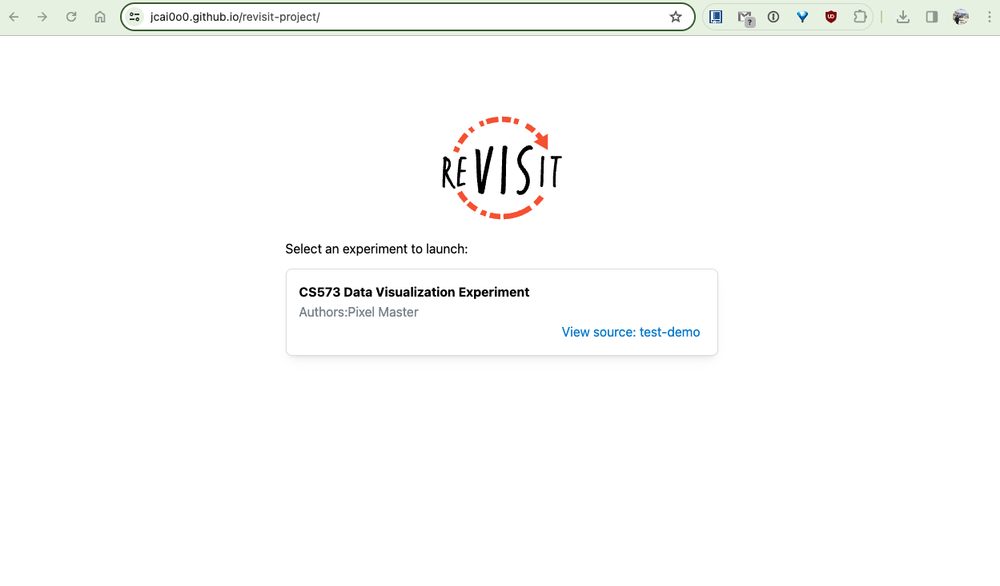
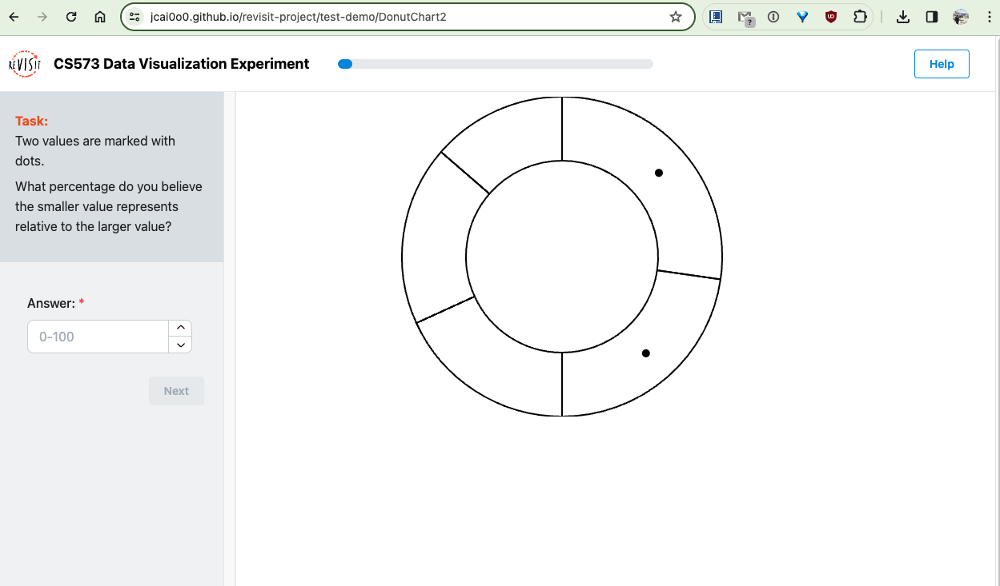
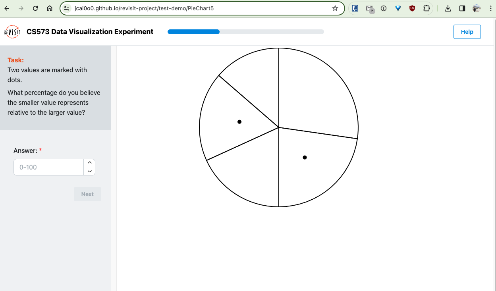
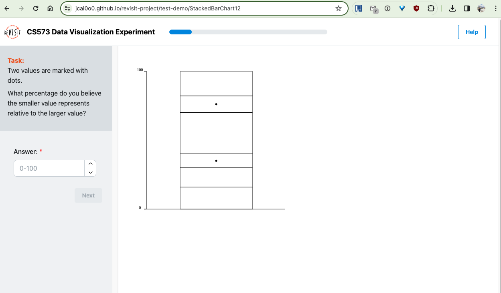
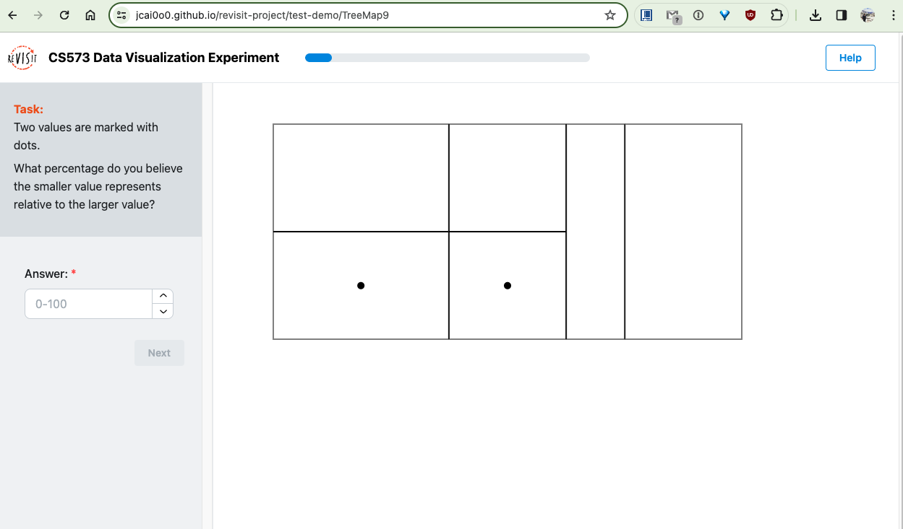
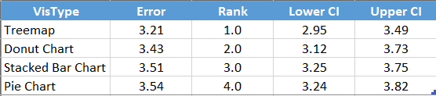

Exploring the Effectiveness of Proportional Graphs: A Comparative Analysis of Chart Types
===
### Team: 

**Pixel Master**: Gan-Erdene Benderiya, Jingni Cai, Ester Jere, Antonela Tamagnini

### Related links
Survey link: https://jcai0o0.github.io/revisit-project/

Survey repository: https://github.com/jcai0o0/revisit-project

Interview Questionnaire: [Post Survey Interview](https://github.com/jcai0o0/a3-Experiment/blob/main/post-survey-interview/post%20survey%20questionnaire.pdf)

____

### Introduction
Proportional graphs, also referred to as "percentage" or "parts-of-a-whole" graphs, visually represent the parts of a whole entity and illustrate the proportion or percentage each part contributes to the total.

Understanding the effectiveness of different visualization techniques is pivotal for conveying complex data insights accurately and intuitively. In this study, we delve into the realm of parts-of-a-whole graphs, investigating the ease of comprehension and accuracy across four distinct chart types: treemap, pie chart, stacked bar chart, and donut chart.

Our study aims to conduct a survey-based investigation, where participants are presented with two dots marked in each visualization. Their task is to identify which proportion represents the smallest part in relation to the largest part, guided solely by the placement of these dots. By employing this novel approach, we can gauge the perceptual ease and accuracy associated with each chart type.

In our project, we conducted 60 individual surveys, and we measured accuracy in identifying relative proportions. This output allowed us to determine which chart types facilitate a more intuitive comprehension and precise interpretation. 

The findings of this research hold significant implications for data visualization practitioners. By unveiling the comparative effectiveness of parts-of-a-whole graphs, we can inform best practices in chart selection, ultimately enhancing the clarity and impact of data-driven communication strategies.

### Understanding Different Visualizations
- Pie Chart: Common for showing proportions within a whole, pie charts are intuitive for some comparisons but can be challenging for precise quantitative comparisons.
- Stacked Bar Chart: This visualization is effective for showing part-to-whole relationships and trends over time or across categories, potentially offering clearer quantitative assessment than pie charts.
- Treemap: Treemaps are useful for displaying hierarchical data and proportions within a whole, offering a different spatial representation than pie charts.
- Donut Chart: Similar to a pie chart, but with a blank center, a donut chart is used to display proportions or percentages of a whole.

---
### Hypothesis
- Users may find pie charts most intuitive for understanding general proportions but struggle with precise comparisons.
- Stacked bar charts may facilitate better quantitative analysis and comparison across categories than pie charts.
- Treemaps, while effective for displaying large datasets, may require more cognitive effort to interpret than pie or stacked bar charts.
- Donut charts with multiple concentric rings or hierarchical data may require more cognitive effort to interpret compared to simple pie charts or stacked bar charts.

### Revisit experiment screenshots
#### Landing page of the experiment

#### Visualization: Donut Chart

#### Visualization: Pie Chart

#### Visualization: Stacked Bar Chart

#### Visualization: Treemap

## Results of the study

The previous table displays the results of the Log2 Error results for each of the visualization types analyzed, the ranking of accuracy based on the error rate, with 1 being the most accurate, and the lower and upper confidence intervals.

The boxplot shows the log error value for the different graph types. The central point represents the median log error for each visualization type. The horizontal lines extending to the left and right from the median represent the confidence intervals, indicating the variability or spread of the log error in the data for that visualization type. The narrower the line, the less variability there is in the log error measurements for that type of visualization.

Considering the minimal variation in error rates among the four visualization types examined—treemap, donut chart, stacked bar chart, and pie chart—it can be inferred that while treemaps marginally outperform the others, the overall difference is not significant.
In conclusion, data visualization practitioners can confidently employ any of these formats knowing that they all similarly support accurate parts-of-a-whole interpretations.

### Design and Technical Achievements

#### Visualization Types Used (D3)

D3, is a powerful tool to help in creating different types of visualizations like: 
- bar charts 
- donut charts 
- tree charts
- pie charts 
It allows for flexibility in terms of data visualization where they can be animated or not 
- The D3 has been used in ensuring smooth transitions from one event to another.

#### Program to Retrieve Data from Firebase Using Python

- This was used because Python easily establishes a connection to Firebase projection making it easy to retrieve data and incorporate it in a Python application for manipulation 
- The use of Python in Firebase for data retrieval offers great scalability making it possible to handle large volumes of data with ease 
- Python as a language offers a lot of flexibility in database manipulation as it can connect to any type of database like Object Oriented Relational Models or just SQL Queries it can handle it 
- Although using python can be a good and efficient way to retrieve data, security is always a concern as Python does not offer much flexibility in protecting data from things like SQL injections.

#### Console Logging and Debugging

- This has helped the developers to quickly give feedback to the users as the errors were logged in real-time hence increasing customer satisfaction. 
- This provided the ability to easily identify errors as they were being logged as this allows the developer to identify the types of errors to log hence making it possible to track any errors and quickly resolve them. 
- The system logged messages at important stages and this gave the developing team a chance to track data movement and trace where data was lost and where data was not converted as required. 
- Console logging provides a security audit for the application as it logs userid and user operations it becomes easy to know user operations and trace what user did unnecessary transactions.

#### Custom Styling and Layout

- The simple and flexible layout of the experiment made it easy for users to quickly finish their surveys 
- The user interface had CSS applied to make the rendering appealing to the users 
- Although the design could display on both mobile and computer devices, uses on mobile devices had some challenges compared to those who used laptops.

#### Dynamic Data Binding & Interaction Handling

- This is a powerful element to include as it ensures that change in the data does not affect the object it is bound to hence making changes more flexible 
- The ability to respond to user events is well represented that no user clicks results in an undescriptive error 
- This allows for the implementation of random data manipulation as in the case where graphs and or questions are randomly generated 
- The ability to easily handle errors like using try catch has been implemented well in the application.

